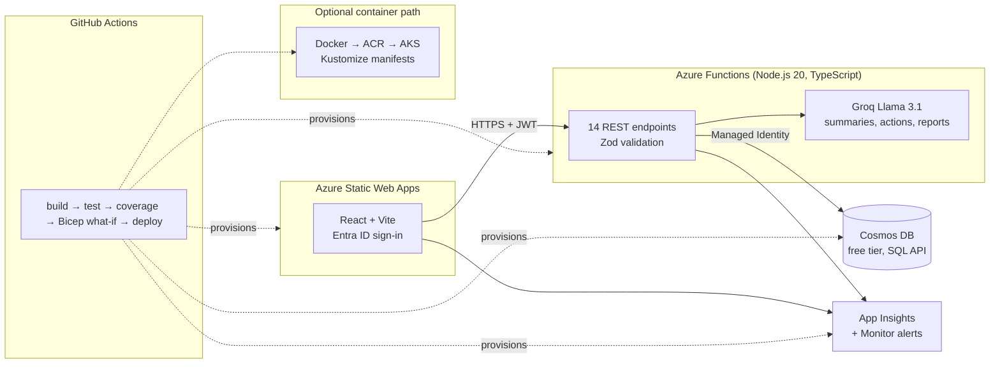

# Incident Postmortem Manager (Azure)

An Azure-first, 3-tier application to create and manage incident postmortems: incident timeline, customer impact, contributing factors, action items, and exportable writeups, with AI-powered analysis.

[](https://github.com/ryana79/incident-postmortem-manager/actions/workflows/ci.yml)


## Engineering Highlights

- **Serverless REST API with 14 endpoints** (Azure Functions, Node.js 20, TypeScript) covering incident CRUD, timeline events, action items, Markdown export, and 3 AI-assisted analysis routes.
- **43 Jest unit tests** run with coverage reporting on every push. See the CI badge above and the coverage summary in each workflow run.
- **~960 lines of Infrastructure as Code** in two parallel stacks: Azure Bicep (core, monitoring, optional AKS) and Terraform, so the same environment is reproducible either way.
- **CI/CD with safety rails**: GitHub Actions pipeline runs build → test → coverage → Bicep `what-if` preview before any deploy touches Azure.
- **Least-privilege security**: Managed Identity for Cosmos DB access (no connection strings in app code), Entra ID auth, RBAC.
- **Observability included**: Application Insights with custom dashboards and latency/error alerting provisioned by `scripts/setup-monitoring.sh`.
- **$0 steady-state cost**: runs entirely on Azure free tiers (Functions Consumption, Cosmos DB free tier, Static Web Apps), with an optional AKS/Docker path for the containerized variant.

## Demo

- **Live Demo**: [https://incident-postmortem-manager.netlify.app](https://incident-postmortem-manager.netlify.app)
- **Source**: https://github.com/ryana79/incident-postmortem-manager

To stand up a dedicated Azure infrastructure instance with Cosmos DB and Azure Functions, follow [DEPLOY.md](DEPLOY.md), or run locally via the quickstart below.

## Architecture



### Tech Stack
| Layer | Technology | Why |
|-------|------------|-----|
| **Frontend** | Azure Static Web Apps, React, Vite | Free tier, global CDN, built-in auth |
| **API** | Azure Functions (Consumption), TypeScript | Serverless, scales to zero, free grant |
| **Database** | Cosmos DB (SQL API) | Free tier (1000 RU/s), global distribution |
| **Auth** | Azure AD / Entra ID | Enterprise identity, RBAC, multi-tenant |
| **AI** | Groq (Llama 3.1) | Fast AI summaries, action suggestions |
| **IaC** | Bicep + Terraform | Azure-native + multi-cloud options |
| **CI/CD** | GitHub Actions | Free for public repos, Azure integration |
| **Monitoring** | Application Insights + Azure Monitor | Dashboards, alerts, distributed tracing |
| **Containers** | Docker + Kubernetes (AKS) | Optional enterprise deployment path |

## Features

### Core Features
- Create incidents (title, severity, status, dates, services impacted)
- Timeline events (what happened, when, who)
- Action items (owner, due date, status)
- Audit log (who changed what)
- Export postmortem to Markdown

### AI-Powered Features
- **Generate Summary:** AI analyzes timeline and creates incident summary
- **Suggest Actions:** AI recommends follow-up action items
- **Generate Report:** AI creates comprehensive postmortem report

### Enterprise Features
- Azure AD / Entra ID authentication
- Multi-tenant data isolation
- Role-based access control (RBAC)
- Operational dashboards and alerts

## Repo Layout

```
├── infra/
│   ├── main.bicep           # Core infrastructure
│   ├── monitoring.bicep     # Dashboards & alerts
│   ├── aks.bicep            # Optional AKS cluster
│   └── terraform/           # Terraform alternative
├── api/
│   ├── src/functions/       # Azure Functions
│   ├── src/test/            # Jest unit tests
│   └── Dockerfile           # Container build
├── web/
│   └── src/                 # React frontend
├── k8s/                     # Kubernetes manifests
├── scripts/                 # Deployment scripts
└── .github/workflows/       # CI/CD pipelines
```

## Local Development

### Prerequisites
- Node.js 20+
- Azure Functions Core Tools v4
- (Optional) Docker

### Run API
```bash
cd api
npm install
npm run dev
```

### Run Web
```bash
cd web
npm install
npm run dev
```

### Run Tests
```bash
cd api
npm test              # Run tests
npm run test:coverage # With coverage report
```

## Deployment Options

### Option 1: Serverless (Free Tier)
```bash
# See DEPLOY.md for full instructions
az deployment group create \
  --resource-group rg-postmortem-dev \
  --template-file infra/main.bicep
```

### Option 2: Terraform
```bash
cd infra/terraform
terraform init
terraform plan
terraform apply
```

### Option 3: Kubernetes (AKS)
```bash
# Deploy AKS cluster
az deployment group create -f infra/aks.bicep

# Build and push Docker image
docker build -t postmortem-api ./api
az acr login -n <acr-name>
docker push <acr-name>.azurecr.io/postmortem-api

# Deploy to Kubernetes
kubectl apply -k k8s/
```

## Monitoring

Deploy operational dashboards and alerts:
```bash
./scripts/setup-monitoring.sh
```

This creates:
- Request rate dashboard
- Response time monitoring
- Error rate alerts
- Function execution tracking

## Design Notes

- **Why two IaC stacks?** Bicep is the Azure-native path with `what-if` previews wired into CI; the Terraform stack mirrors it for teams standardized on multi-cloud tooling. Both provision the same topology.
- **Why Managed Identity over connection strings?** The Functions app authenticates to Cosmos DB with its Azure-managed identity, so there are no database secrets to rotate, leak, or store in app settings.
- **Why the optional AKS path?** The serverless tier is the cost-efficient default; the Docker/AKS variant (with Kustomize manifests and horizontal pod autoscaling) exists to demonstrate the same API running in a container-orchestrated environment.
